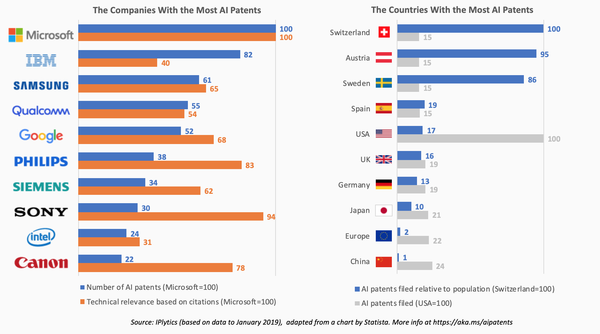

# AI Patents Data 2019

## About

In April 2019, IPlytics released a report analyzing 448,684 patents filed over the last 10 years in the field of AI [1]. I have adapted a chart published by Statista [2] to include additional data from the IPlytics report, including metrics for technical relevance and filings by country.

I have [posted the following chart on LinkedIn](https://www.linkedin.com/feed/update/urn:li:activity:6551404459820359680):

## Data

Below are the data behind the numbers in the chart.

Here is the data from the IPlytics report:

Company   | Number of patents | Technical relevance
--------- | ----------------- | --------------------
Microsoft | 18365             | 1.55
IBM       | 15046             | 0.62
Samsung   | 11243             | 1
Qualcomm  | 10178             | 0.83
Google    | 9536              | 1.06
Philips   | 7023              | 1.28
Siemens   | 6192              | 0.96
Sony      | 5526              | 1.45
Intel     | 4464              | 0.48
Canon     | 3996              | 1.21

IPlytics also analyzed identify at which office patents were filed, or designated states/regions. The data is shown below, along with the UN population estimates for 2019 [3].

| Country     | Patents| Population
| ----------- | ------ | ----------
| Switzerland |  41668 |    8591365
| Austria     |  41331 |    8955102
| Sweden      |  42064 |   10036379
| Spain       |  42256 |   46736776
| USA         | 279145 |  329064917
| UK          |  53502 |   67530172
| Germany     |  53897 |   83517045
| Japan       |  58988 |  126860301
| Europe (EPO)|  60346 |  624084199 (see below)
| China       |  66508 | 1433783686

The data for Europe refers to the European Patent Office, which as of April 2019 covers the following countries [4]:

| Country       | Population
| ------------- | ----------
Albania         | 2880917
Austria         | 8955102
Belgium         | 11539328
Bulgaria        | 7000119
Croatia         | 4130304
Cyprus          | 1179551
Czech Republic  | 10689209
Denmark         | 5771876
Estonia         | 1325648
Finland         | 5532156
France          | 65129728
Germany         | 83517045
Greece          | 10473455
Hungary         | 9684679
Iceland         | 339031
Ireland         | 4882495
Italy           | 60550075
Latvia          | 1906743
Liechtenstein   | 38019
Lithuania       | 2759627
Luxembourg      | 615729
North Macedonia | 2083459
Malta           | 440372
Monaco          | 38964
Netherlands     | 17097130
Norway          | 5378857
Poland          | 37887768
Portugal        | 10226187
Romania         | 19364557
San Marino      | 33860
Serbia          | 8772235
Slovakia        | 5457013
Slovenia        | 2078654
Spain           | 46736776
Sweden          | 10036379
Switzerland     | 8591365
Turkey          | 83429615
United Kingdom  | 67530172

## References

* [1] [IPlytics report: Who is patenting AI technology?](https://www.iplytics.com/wp-content/uploads/2019/03/IPlytics-AI-report.pdf) (accessed 2019-07-01)
* [2] [ECN Magazine: The Companies with the Most AI Patents](https://www.ecnmag.com/news/2019/05/companies-most-ai-patents) (accessed 2019-07-01)
* [3] [Wikipedia: List of countries by population (United Nations)
] (https://en.wikipedia.org/wiki/List_of_countries_by_population_(United_Nations))(accessed 2019-07-01)
* [4] [Wikipedia: European Patent Organisation](https://en.wikipedia.org/wiki/European_Patent_Organisation) (accessed 2019-07-01)
